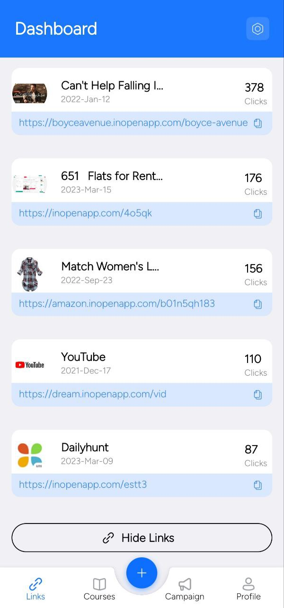
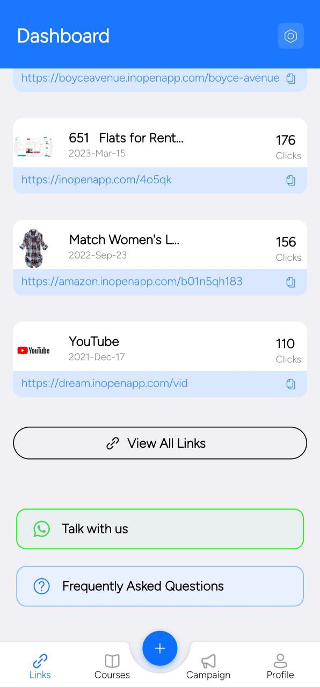

# Android Interview Assignment App

This repository contains a Native Android app developed as part of an internship interview process for Listed Inc. OpenInApp. 
The assignment involves creating the app from scratch based on a simple UI design provided as a Figma file.

### Backend

- **HTTP Client:** [Ktor](https://ktor.io/) 🌐
  Ktor includes a multiplatform asynchronous HTTP client, which allows you to make requests and handle responses, 
  extend its functionality with plugins, such as authentication, JSON serialization, and so on.  
- **Dependency Injection:** [Hilt](https://dagger.dev/hilt/) 🔧
  Hilt provides a standard way to incorporate Dagger dependency injection into an Android application.
  The goals of Hilt are:
  - To simplify Dagger-related infrastructure for Android apps.
  - To create a standard set of components and scopes to ease setup, readability/understanding, and code sharing between apps.
  - To provide an easy way to provision different bindings to various build types (e.g. testing, debug, or release).
 
### Frontend
- **Language:** Kotlin
- **UI Framework:** [Jetpack Compose](https://developer.android.com/jetpack/compose) 🚀
  Modern Android UI toolkit that simplifies and accelerates UI development.
- **Material Design:** [Material3](https://m3.material.io/) 🎨
  Material Design system for Android, offering a consistent and visually appealing UI.
- **Graphs:** [YCharts](https://github.com/codeandtheory/YCharts) 📊
  Library for incorporating interactive charts into the application.
  

## Getting Started

To run the app locally, follow these steps:

1. Clone the repository.
2. Open the project in Android Studio.
3. Build and run the app on an emulator or physical device.

Happy coding!

 [two.jpg](app/src/main/res/drawable/two.jpg)
 
